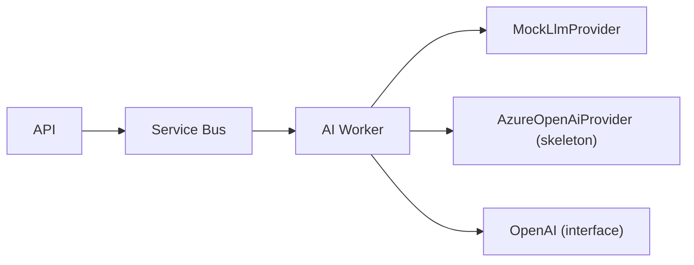

# AI Pipeline

The AI worker turns transcribed lectures into study material and powers RAG
chat. Providers are abstracted so local development uses a deterministic mock.

## Providers



- `LlmProvider` interface: `generate({ system, user, maxTokens, timeoutMs })`.
- `MockLlmProvider`: deterministic responses derived from a prompt hash.
- `AzureOpenAiProvider`: skeleton reading `AZURE_OPENAI_*` env (not live in Phase 1).
- `OpenAiProvider`: reserved interface.

## Job types

- `LECTURE_SUMMARY`
- `KEY_CONCEPT_EXTRACTION`
- `FLASHCARD_GENERATION`
- `EMBEDDING_GENERATION`

## Citations

AI answers carry `Citation` objects:

```ts
interface Citation {
  id: string;
  sourceType: 'TRANSCRIPT_SEGMENT' | 'DOCUMENT' | 'LECTURE' | 'COURSE';
  lectureId?: string;
  transcriptSegmentId?: string;
  timestampStart?: number;
  timestampEnd?: number;
  documentId?: string;
  documentPage?: number;
  sourceLabel: string;
}
```

## Prompt-injection protection

- System instructions and untrusted user/transcript content are kept separate.
- Transcript text is treated as **data**, never as instructions.
- Inputs are length-limited (`MAX_UNTRUSTED_INPUT_CHARS = 20000`).
- Provider calls are wrapped with timeouts and a retry policy.
- Errors are sanitized before logging (no secrets/PII).
- User content is not used to train models by default.

## RAG

Embeddings are stored in PostgreSQL via pgvector. Chat retrieves the most
relevant transcript/document segments and generates a grounded answer with
citations.
