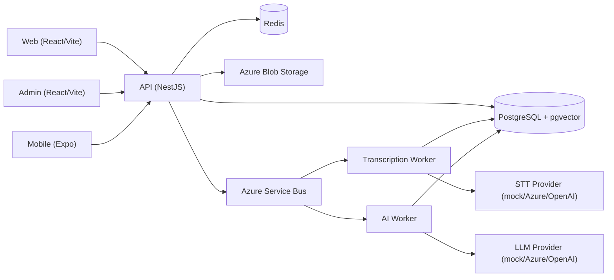
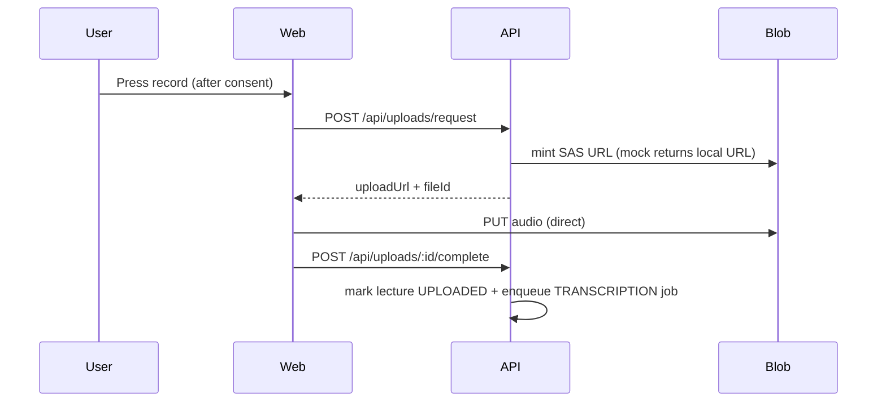

# Architecture

Fariha MindFlow AI is a pnpm + Turborepo monorepo spanning web, admin, mobile,
three backend services and shared packages.

## System boundaries

## Request flow (authenticated)

1. Client obtains a JWT access token via `POST /api/auth/login`.
2. API validates the token with `JwtAuthGuard` and role with `RolesGuard`.
3. Controllers call in-memory repositories (Phase 1) or Prisma in production.
4. `AllExceptionsFilter` normalizes errors with a request id.

## Recording flow

## Transcription flow

The API enqueues a `TRANSCRIPTION` job. The transcription worker reads the job,
fetches audio, calls the STT provider, stores transcript segments, marks the
lecture `TRANSCRIBED` and enqueues AI analysis.

## AI analysis flow

The AI worker processes `LECTURE_SUMMARY`, `KEY_CONCEPT_EXTRACTION`,
`FLASHCARD_GENERATION` and `EMBEDDING_GENERATION` jobs, storing results and
citations. Prompts keep system instructions separate from untrusted transcript
content (see [AI_PIPELINE.md](./AI_PIPELINE.md)).

## RAG flow

Embeddings are stored in PostgreSQL via pgvector. Chat answers are generated
from retrieved transcript/document segments and returned with citations.

## Deletion flow

Lecture/account deletion sets a soft `DELETED` state, revokes sessions, queues a
storage deletion and writes an audit log entry.

## Security boundaries

- Public endpoints are marked `@Public()`; everything else requires a valid JWT.
- CORS is restricted to configured origins.
- All errors are safe, PII-free and carry a `requestId`.
- Rate limiting is scaffolded via `@nestjs/throttler`.

## Observability

- Structured JSON logs with `requestId`, `userId` (when available) and `level`.
- Swagger at `/api/docs`.
- Health at `GET /api/health`.

## Failure handling

- Transcription/AI jobs track `retryCount`/`maxRetries` and dead-letter on
  exhaustion.
- The API returns `FAILED` lecture states with safe error codes.
